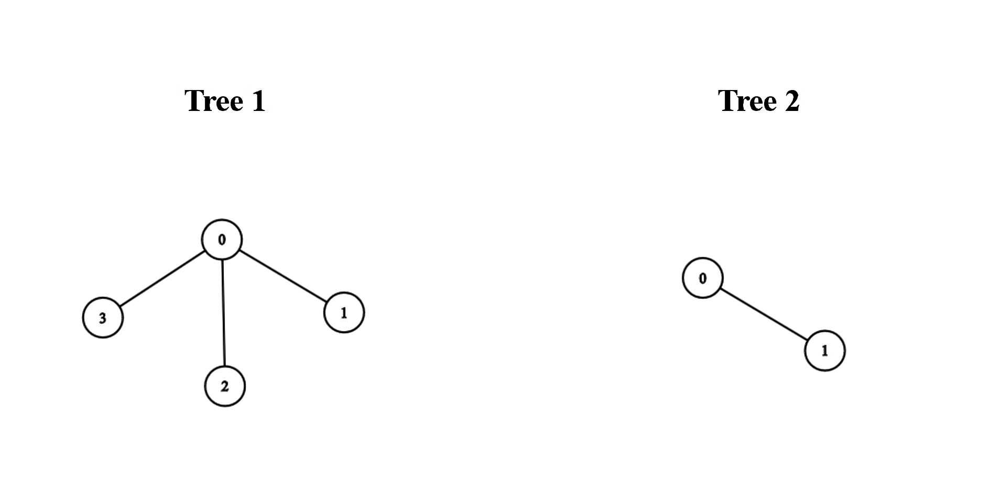

# 3203. Find Minimum Diameter After Merging Two Trees

There exist two **undirected** trees with `n` and `m` nodes, numbered from `0` to `n - 1` and from `0` to `m - 1`, respectively. You are given two 2D integer arrays `edges1` and `edges2` of lengths `n - 1` and `m - 1`, respectively, where `edges1[i] = [ai, bi]` indicates that there is an edge between nodes `ai` and `bi` in the first tree and `edges2[i] = [ui, vi]` indicates that there is an edge between nodes `ui` and `vi` in the second tree.

You must connect one node from the first tree with another node from the second tree with an edge.

Return the **minimum** possible **diameter** of the resulting tree.

The **diameter** of a tree is the length of the _longest_ path between any two nodes in the tree.

**Example 1:**



* **Input:** edges1 = [[0,1],[0,2],[0,3]], edges2 = [[0,1]]
* **Output:** 3
* **Explanation:**
    ```
    We can obtain a tree of diameter 3 by connecting node 0 from the first tree with any node from the second tree.
    ```

**Example 2:**


* **Input:** edges1 = [[0,1],[0,2],[0,3],[2,4],[2,5],[3,6],[2,7]], edges2 = [[0,1],[0,2],[0,3],[2,4],[2,5],[3,6],[2,7]]
* **Output:** 5
* **Explanation:**
    ```
    We can obtain a tree of diameter 5 by connecting node 0 from the first tree with node 0 from the second tree.
    ```

**Constraints:**

*   `1 <= n, m <= 105`
*   `edges1.length == n - 1`
*   `edges2.length == m - 1`
*   `edges1[i].length == edges2[i].length == 2`
*   `edges1[i] = [ai, bi]`
*   `0 <= ai, bi < n`
*   `edges2[i] = [ui, vi]`
*   `0 <= ui, vi < m`
*   The input is generated such that `edges1` and `edges2` represent valid trees.
